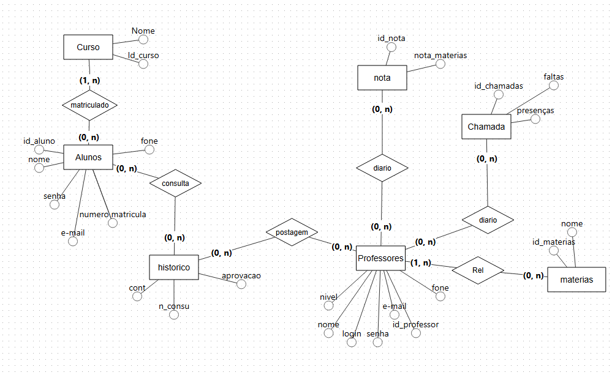

# TRABALHO DE PI:  Título do Trabalho
Trabalho desenvolvido durante a disciplina de projeto Integrador

# Sumário

### 1. COMPONENTES 
Integrantes do grupo 
Arthur Souza:souzasilvaarthur2008@gmail.com 
Arthur Castilho:castilhoa078@gmail.com 
Davi Amorim: davilaures@outlook.com 
Jackson Ferreira: jacksonfsouza05@gmail.com 
Pedro Henrique: pptesch@gmail.com 

 
### 2. Ideias Selecionadas, Matriz de selecao e OpportunityCard

#### 2.1 Ideias Selecionadas pelo grupos
Após realiza a Dinâmica Prática 5–5–5 (Problemas, soluções atuais e pessoas),  descreva as 2 principais ideias definidas pelo grupo . 

  Ideia 1:  Gestão Escolar
  Ideia 2:  Gestão de Estoque

#### 2.2 Matriz de seleção
  

Ideia 1: Gestão Escolar 
afinidade [ 9/10 ], processo [ 9/10 ], problema [ 10/10 ], valor do software [ 9/10 ], viabilidade [ 9/10 ]

Nota final: [ 9,2/10 ]

Ideia 2: Gestão de Estoque 
afinidade [ 8/10 ], processo [ 8/10 ], problema [ 9/10 ], valor do software [ 9/10 ], viabilidade [ 10/10 ]

Nota final: [ 8,8/10 ]

#### 2.3. Opportunity Card da ideia selecioanda

  

Descreva o que o foi definido pelo grupo para cada item abaixo referenta ao Opportunity Card da ideia selecioanda
1. Área de afinidade/contexto: 
Ambiente escolar e organização acadêmica de estudantes do curso 
técnico. 
 
2. Problema percebido 
Muitos alunos esquecem prazos de trabalhos, provas e atividades, pois 
as informações ficam espalhadas em grupos de WhatsApp, Google 
Classroom, cadernos e anotações pessoais.  

3. Quem possui o problema 
Alunos do curso técnico  
Estudantes que participam de vários grupos de disciplinas  
Alunos que trabalham e estudam ao mesmo tempo 

4. Como é resolvido hoje 
Atualmente os alunos utilizam:  
● WhatsApp  
● Google Classroom  
● Agenda do celular  
● Caderno de anotações  
● Lembretes manuais  

5. Soluções semelhantes  
● Google Agenda  
● Todoist  
● Trello  
● Microsoft To Do  
● Notion 

6. Lacuna inicial 
As soluções existentes não são voltadas especificamente para a 
realidade escolar da turma. As informações continuam dispersas, os 
lembretes dependem da configuração do usuário e não há uma 
visualização única de todas as atividades acadêmicas. 

7. Pessoas acessíveis 
O grupo consegue conversar com:  
● 5 colegas da turma  
● 1 representante de sala  
● 1 professor  
● 1 coordenador acadêmico 
Essas pessoas podem ajudar a validar se o problema realmente ocorre 
com frequência. 

8. Hipótese de oportunidade 
Desenvolver um aplicativo simples chamado OrganizaAí, que reúna em 
um único lugar:  
● trabalhos  
● provas  
● atividades  
● lembretes automáticos  
● calendário acadêmico  
● notificações antes do vencimento  

9. Fomento/oportunidade 
O uso de smartphones entre os estudantes é praticamente universal. 
Um aplicativo leve, gratuito e focado na rotina escolar pode aumentar a 
organização dos alunos, reduzir esquecimentos e melhorar o 
acompanhamento das disciplinas.  

10. Principal incerteza/desafio 
A principal dúvida é saber se os alunos realmente adotariam um novo 
aplicativo, já que muitos já utilizam WhatsApp e Google Classroom 
diariamente 

### 3.MINIMUNDO 
O sistema OrganizaAí tem como objetivo auxiliar estudantes no controle de suas atividades acadêmicas, como trabalhos, provas e tarefas.
Cada aluno possui um cadastro contendo matrícula, nome, e-mail e telefone. Um aluno pode estar matriculado em várias disciplinas, e cada disciplina pode possuir vários alunos.
Cada disciplina é ministrada por um professor, que possui código, nome e e-mail.
Em cada disciplina podem ser cadastradas várias atividades. Uma atividade possui título, descrição, data de entrega e tipo (trabalho, prova, exercício ou projeto).
Os alunos recebem lembretes sobre as atividades cadastradas. Um lembrete possui data e hora de envio e está relacionado a uma atividade específica e a um aluno específico
 

### 4.  Validação da Ideia. 
a) Link do formulário desenvolvido 
https://docs.google.com/forms/d/e/1FAIpQLSd3xThaO2rTdojsGqWAGcErg4Hvr0ipNrDhEcw1tZR1DnMxTw/viewform?usp=sharing&ouid=116192333663505816718
 
b) Link para Relatório/Apresentação de resultados obtidos 
FAZER  

### 4.Personas e Histórias de usuário 
3 PERSONAS — SISTEMA ESCOLAR 
Persona 1 — Lucas 
Idade: 16 anos 
Perfil: Aluno do Ensino Médio 
Objetivo: 
 Acompanhar suas atividades escolares, notas e frequência sem precisar depender de informações espalhadas. 
O que ele quer: 
    • Consultar notas; 
    • Ver frequência e faltas; 
    • Acessar atividades; 
    • Consultar horários das aulas; 
    • Receber avisos dos professores; 
    • Acompanhar seu desempenho. 
O que ele não quer: 
    • Sistema complicado; 
    • Informações desatualizadas; 
    • Ter que procurar informações em vários lugares; 
    • Perder prazos de atividades. 

Persona 2 — Camila 
Idade: 34 anos 
Perfil: Professora 
Objetivo: 
 Organizar suas turmas e acompanhar o desempenho dos alunos. 
O que ela quer: 
    • Registrar notas; 
    • Registrar presença e faltas; 
    • Publicar atividades; 
    • Consultar alunos das suas turmas; 
    • Enviar avisos; 
    • Acompanhar o desempenho da turma; 
    • Consultar o histórico dos alunos. 

O que ela não quer: 
    • Preencher a mesma informação várias vezes; 
    • Sistema lento; 
    • Processos burocráticos; 
    • Dificuldade para encontrar os dados dos alunos. 

 Persona 3 — Fernanda 
Idade: 41 anos 
Perfil: Coordenadora pedagógica 
Objetivo: 
 Acompanhar o funcionamento acadêmico da escola e o desempenho dos alunos e professores. 
O que ela quer: 
    • Consultar informações das turmas; 
    • Acompanhar notas e frequência; 
    • Gerar relatórios; 
    • Consultar professores e alunos; 
    • Identificar alunos com baixo desempenho; 
    • Acompanhar atividades e avaliações; 
    • Organizar informações acadêmicas. 
O que ela não quer: 
    • Dados desatualizados; 
    • Relatórios confusos; 
    • Informações espalhadas; 
    • Falta de comunicação entre professores e coordenação. 

  

HISTÓRIAS DE USUÁRIOS 

EXEMPLO 1 - LUCAS  

Como aluno da escola, eu quero consultar notas, frequências, consultar horários e outros, para facilitar e acompanhar minha evolução e notas. 

EXEMPLO 2 - CAMILA 

Como professora de escolas, eu quero publicar notas, registrar presenças e faltas, enviar avisos e outros, para exercer meu trabalho de forma prática.. 

EXEMPLO 3 - FERNANDA 

Como Coordenadora pedagógica, eu quero consultar informações das turmas, gerar relatórios, acompanhar notas e frequências, organi	zar informações acadêmicas, para que o funcionamento da escola aconteça e fique organizada 

### 5. PROTÓTIPOS DO SISTEMA 
PROTÓTIPO DO SISTEMA: https://www.figma.com/make/06nSm40jWNLCTANOQbtJwf/Implementar-solicita%C3%A7%C3%A3o-anterior?t=MoawVm13JkvgedsH-1  

#### 5.1 QUAIS PERGUNTAS PODEM SER RESPONDIDAS COM OS SISTEMA WEB/MOBILE PROPOSTOS?
    a) O sistema proposto poderá fornecer quais tipos de relatórios e informaçes?  
    b) Crie uma lista com os 5 principais relatórios que poderão ser obtidos por meio do sistema proposto! 
    
>O sistema oferece informações detalhadas e relatórios voltados ao gerenciamento acadêmico e acompanhamento de desempenho do estudante, tais como:   Resumos de atividades: Visão geral de atividades pendentes, concluídas, com prazos próximos ou agendadas para o dia.   Indicadores de progresso: Percentual de conclusão geral dos estudos e o avanço específico em cada matéria cadastrada.   Alertas e avisos de prazos: Notificações automáticas sobre vencimentos próximos e resumos diários ou semanais de tarefas.   Visão cronológica/calendário: Exibição detalhada de tarefas organizadas por datas, prazos e status (pendente, com prazo próximo, concluída). 

>Lista com os 5 principais relatórios que poderão ser obtidos por meio do sistema proposto: 
Relatório de Atividades Próximas ao Prazo: Lista focada nas tarefas que vencem em breve, destacando o nome da atividade, matéria, dias restantes e data limite. 
Relatório de Progresso Geral e por Matéria: Métrica detalhada que exibe o percentual de conclusão dos estudos (ex: total de atividades concluídas em relação ao total cadastrado) e o desempenho individual por disciplina (como Matemática, História, etc.).    Resumo Diário de Pendências: Notificação ou relatório gerado periodicamente contendo a listagem das atividades pendentes para o dia.     Relatório Semanal de Progresso: Informe periódico enviado para acompanhar a evolução dos estudos e o rendimento semanal do aluno.    Relatório Cronológico (Calendário de Estudos): Visão consolidada em formato de calendário ou lista mensal que mapeia todas as provas, trabalhos e tarefas distribuídas ao longo dos dias do mês. 
 
 ### 6.MODELO CONCEITUAL 
    A) Utilizar a Notação adequada (Preferencialmente utilizar o BR Modelo 3)
    B) O mínimo de entidades do modelo conceitual pare este trabalho será igual a 4.
        * informe quais são as 3 principais entidades do sistema em densenvolvimento
      (se houverem mais de 3 entidades, pense na importância da entidade para o sistema)       
    C) Principais fluxos de informação/entidades do sistema (mínimo 2).  Dica: normalmente estes fluxos estão associados as tabelas que conterão maior quantidade de dados 
    D) Qualidade e Clareza
        Garantir que a semântica dos atributos seja clara no esquema (nomes coerentes com os dados).
        Criar o esquema de forma a garantir a redução de informação redundante, possibilidade de valores null, 
        e tuplas falsas (Aplicar os conceitos de normalização abordados).   
        
      
    
#### 7 Descrição dos dados 
    CURSO: Tabela que armazena as informações relativas ao curso 
nome: campo que armazena a denominação oficial do curso 
id_curso: chave primária que identifica unicamente cada curso 
 
ALUNOS: Tabela que armazena as informações relativas ao aluno 
id_aluno: chave primária que identifica unicamente o aluno 
nome: campo que armazena o nome completo do aluno 
senha: campo que armazena a senha de acesso ao sistema 
e-mail: campo que armazena o endereço de correio eletrônico do aluno 
numero_matricula: campo que armazena o número oficial de matrícula 
fone: campo que armazena o número de telefone de contato 
 
HISTORICO: Tabela que armazena as informações relativas ao histórico acadêmico 
cont: campo que armazena a contagem ou quantidade de registros 
n_consu: campo que armazena o número de consulta do histórico 
aprovacao: campo que armazena o status de aprovação na disciplina 
 
NOTA: Tabela que armazena as informações relativas às notas das avaliações 
id_nota: chave primária que identifica unicamente a nota 
nota_materias: campo que armazena o valor da nota obtida na matéria 
 
CHAMADA: Tabela que armazena as informações relativas ao controle de chamadas e frequência 
id_chamadas: chave primária que identifica unicamente o registro de chamada 
presencas: campo que armazena a quantidade de presenças do aluno 
faltas: campo que armazena a quantidade de faltas do aluno 
 
PROFESSORES: Tabela que armazena as informações relativas ao professor 
id_professor: chave primária que identifica unicamente o professor 
nome: campo que armazena o nome completo do professor 
login: campo que armazena o nome de utilizador para acesso 
senha: campo que armazena a senha de segurança do professor 
e-mail: campo que armazena o e-mail institucional ou de contato 
nivel: campo que armazena o nível ou categoria acadêmica do docente 
fone: campo que armazena o telefone de contato do professor 
 
MATERIAS: Tabela que armazena as informações relativas às disciplinas/matérias 
id_materias: chave primária que identifica unicamente a matéria 
nome: campo que armazena o nome da disciplina

### 8	RASTREABILIDADE DOS ARTEFATOS 
        a) Historia de usuários vs protótipo (Histórias de Usuário e em qual tela do protótipo aquela HU está sendo realizada).
        b) Protótipo vs Modelo conceitual (Histórias de Usuário e em quais tabelas aquele dado está sendo registrado).
        (modelos devem obrigatoriamente estar em conformidade de rastreabilidade)

 
a) Histórias de Usuário vs. Protótipo 
(Associação de cada História de Usuário / Requisito com a respectiva tela do protótipo do sistema AvisAí) 

HU 01 (Lucas - Aluno): Consultar notas e desempenho 

Tela do Protótipo: Tela de Progresso (onde exibe as atividades concluídas e o progresso geral/por matéria) e Tela de Matérias. 

HU 02 (Lucas - Aluno): Ver frequência, faltas e atividades 

Tela do Protótipo: Tela de Atividades (com abas de pendentes, próximas do prazo e concluídas) e Tela de Início (resumo diário). 

HU 03 (Lucas - Aluno): Consultar horários e prazos/calendário 

Tela do Protótipo: Tela de Calendário. 

HU 04 (Camila - Professora): Publicar atividades e conteúdos 

Tela do Protótipo: Tela de Atividades (botão superior "Nova atividade"). 

HU 05 (Camila - Professora): Registrar notas, presenças e faltas 

Tela do Protótipo: Telas de gestão de turmas e diário associadas às abas de Matérias e relatórios de notas/chamadas. 

HU 06 (Fernanda - Coordenadora): Consultar informações de turmas, alunos e professores 

Tela do Protótipo: Tela de Matérias e abas de listagem geral de cadastros. 

HU 07 (Fernanda - Coordenadora): Acompanhar notas, frequência e gerar relatórios 

Tela do Protótipo: Tela de Progresso e painéis de visão geral. 

b) Protótipo vs. Modelo Conceitual 
(Associação de cada Ação/Tela do Sistema com as tabelas do Modelo Conceitual onde os dados são persistidos) 

Gestão de Alunos (Consulta de dados, perfil e identificação): 

Tabelas do Modelo Conceitual: Alunos 

Gestão de Professores e Corpo Docente: 

Tabelas do Modelo Conceitual: Professores 

Organização de Disciplinas e Conteúdos: 

Tabelas do Modelo Conceitual: Curso e materias 

Acompanhamento de Tarefas, Prazos e Histórico Acadêmico: 

Tabelas do Modelo Conceitual: historico 

Lançamento e Consulta de Notas: 

Tabelas do Modelo Conceitual: nota e materias 

Controle de Frequência, Presenças e Faltas (Chamadas): 

Tabelas do Modelo Conceitual: Chamada 

### 4.PMC 

a) inclusão do PMC desenvolvido pelo grupo  
